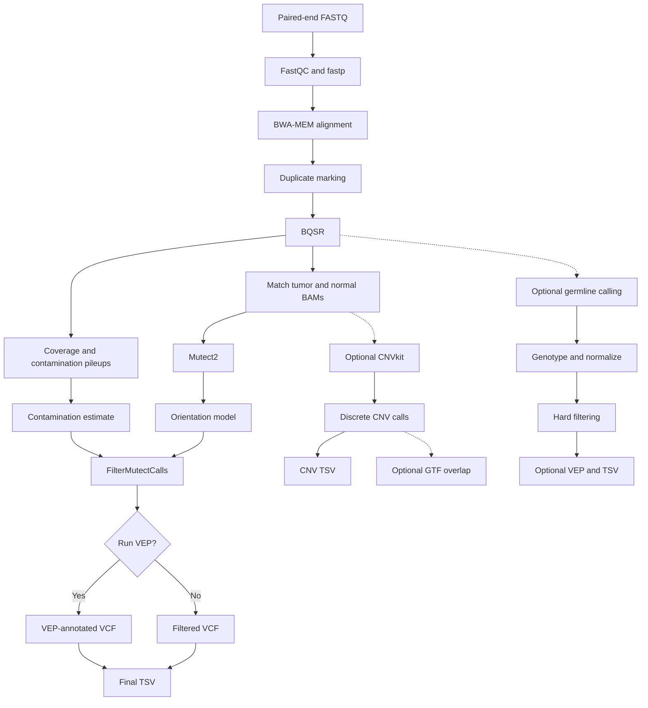

# WES tumor-normal Nextflow


A modular Nextflow DSL2 workflow for reproducible whole-exome sequencing (WES)
analysis of multiple matched tumor-normal pairs. Samples are associated through
`pair_id`, and the workflow validates that every patient has exactly one tumor
sample and one matched normal sample before beginning the analysis.

The primary workflow performs read quality control, trimming, alignment,
duplicate marking, base quality score recalibration, coverage analysis,
somatic variant calling with GATK Mutect2, contamination and orientation-bias
modeling, variant filtering, optional VEP annotation, and generation of a
human-readable TSV table.

> [!WARNING]
> This workflow is intended for research and training. It is not a clinically
> validated diagnostic pipeline. Results must be interpreted considering the
> capture design, sequencing depth, tumor purity, ploidy, sample quality, and
> compatibility of all resources with GRCh38.

## Workflow overview



### Main analysis

1. **FASTQC_RAW** — quality control of the original FASTQ files.
2. **FASTP** — adapter trimming and read-quality filtering.
3. **FASTQC_TRIMMED** — quality control after trimming.
4. **BWA_INDEX** — creates the BWA index if a complete index is not found.
5. **ALIGN_BWA** — alignment to GRCh38 with BWA-MEM and coordinate sorting.
6. **SAMTOOLS_QC_PREDUP** — alignment statistics before duplicate marking.
7. **MARK_DUPLICATES** — marks PCR/optical duplicates without removing them.
8. **SAMTOOLS_QC_POSTDUP** — alignment statistics after duplicate marking.
9. **BASE_RECALIBRATOR** — creates the GATK BQSR recalibration table.
10. **APPLY_BQSR** — applies base quality score recalibration.
11. **MOSDEPTH** — calculates target-region coverage.
12. **GET_PILEUP_SUMMARIES** — collects allele-count data for contamination estimation.
13. **MUTECT2** — calls candidate somatic SNVs and indels for each tumor-normal pair.
14. **LEARN_READ_ORIENTATION_MODEL** — models F1R2 orientation artifacts.
15. **CALCULATE_CONTAMINATION** — estimates tumor-sample contamination using the matched normal.
16. **FILTER_MUTECT_CALLS** — assigns the final Mutect2 filtering decisions.
17. **VEP** — optionally annotates the filtered somatic VCF.
18. **VCF_TO_TSV** — converts the final VCF into a tab-separated variant table.
19. **MULTIQC** — aggregates quality-control reports across the cohort.

### Optional branches

| Flag | Process | Result |
|---|---|---|
| `--run_cnv true` | CNVkit, CNVkit call and TSV conversion | Somatic copy-number segments and discrete copy-number calls for each matched pair |
| `--cnv_gene_annotation <GTF>` | BEDTools gene overlap | Optional exact GENCODE/Ensembl gene overlaps for called CNVs |
| `--run_germline true` | Complete single-sample germline branch | Genotyped, normalized, filtered VCF and TSV for each normal sample |
| `--run_vep true` | Ensembl VEP | Functional annotation of filtered somatic and enabled germline variants |

The germline branch runs HaplotypeCaller, GenotypeGVCFs, bcftools normalization,
type-specific GATK hard filtering, optional VEP annotation, and TSV conversion.
Each normal sample is processed independently. `GenomicsDBImport` is not needed
for this single-sample design; use joint genotyping instead if the scientific
question requires a cohort-level callset.

## Requirements

- Linux
- Nextflow `>=25.04.0`
- Conda or Mamba
- Java compatible with the installed Nextflow version
- Sufficient local storage for FASTQ, BAM, VCF, reference, cache, and `work/` files

The default configuration uses the local executor and assigns separate Conda
environments to the QC, alignment, GATK, bcftools, CNVkit, and VEP process
families.

## Repository structure

```text
WES-tumor-normal-nextflow/
├── main.nf
├── nextflow.config
├── samplesheet.csv
├── modules/
│   ├── fastqc_raw.nf
│   ├── fastp.nf
│   ├── align_bwa.nf
│   ├── mutect2.nf
│   └── ...
├── bin/
│   ├── wes_fastqc.sh
│   ├── wes_align_bwa.sh
│   ├── wes_mutect2.sh
│   └── ...
├── envs/
│   ├── qc.yml
│   ├── alignment.yml
│   ├── gatk.yml
│   ├── bcftools.yml
│   ├── cnvkit.yml
│   └── vep.yml
├── data/
└── reference/
```

FASTQ files, reference resources, VEP cache files, `work/`, and `results/`
should not be committed to GitHub.

## Sample sheet

The input CSV must contain the following columns:

```csv
pair_id,sample,role,fastq_1,fastq_2
P1,TUMOR_01,tumor,/path/to/TUMOR_01_R1.fastq.gz,/path/to/TUMOR_01_R2.fastq.gz
P1,NORMAL_01,normal,/path/to/NORMAL_01_R1.fastq.gz,/path/to/NORMAL_01_R2.fastq.gz
P2,TUMOR_02,tumor,/path/to/TUMOR_02_R1.fastq.gz,/path/to/TUMOR_02_R2.fastq.gz
P2,NORMAL_02,normal,/path/to/NORMAL_02_R1.fastq.gz,/path/to/NORMAL_02_R2.fastq.gz
```

Input rules:

- `pair_id` links the tumor and normal samples from the same patient.
- Every `pair_id` must occur exactly twice: once as `tumor` and once as `normal`.
- `sample` must be unique across the complete cohort.
- `sample` becomes the BAM read-group sample name.
- `pair_id` and `sample` may contain letters, numbers, periods, underscores, and hyphens.
- Absolute FASTQ paths are recommended.

## Reference resources

All resources must use the same genome build and contig naming convention. Do
not mix GRCh37/hg19 with GRCh38, or `1`-style contigs with `chr1`-style contigs.

| Parameter | Required resource |
|---|---|
| `--reference` | GRCh38 FASTA |
| `--reference_fai` | Matching samtools `.fai` index |
| `--reference_dict` | Matching GATK/Picard `.dict` file |
| `--targets` | GRCh38 BED file for the exome capture design |
| `--dbsnp` | dbSNP VCF used by BQSR |
| `--dbsnp_index` | Matching dbSNP `.idx` index |
| `--known_indels` | Known-indels VCF used by BQSR |
| `--known_indels_index` | Matching `.tbi` index |
| `--mills_indels` | Mills and 1000G gold-standard indels VCF |
| `--mills_indels_index` | Matching `.tbi` index |
| `--germline_resource` | Allele-frequency-only gnomAD VCF for Mutect2 |
| `--germline_resource_index` | Matching `.tbi` index |
| `--panel_of_normals` | Mutect2 panel of normals |
| `--panel_of_normals_index` | Matching `.tbi` index |
| `--contamination_sites` | Common-SNP VCF for GetPileupSummaries |
| `--contamination_sites_index` | Matching `.tbi` index |
| `--cnv_gene_annotation` | Optional GRCh38 GENCODE/Ensembl `.gtf` or `.gtf.gz` for CNV-gene overlaps |

The target BED must correspond to the actual exome capture kit. A generic
exome BED should not be substituted when interpreting coverage, variants, or
copy-number changes. The default configuration currently points to Agilent V6
UTR interval files and should be changed or overridden for other capture kits.

### BWA index

The workflow expects the five classic BWA index files next to the reference:

```text
reference.fasta.amb
reference.fasta.ann
reference.fasta.bwt
reference.fasta.pac
reference.fasta.sa
```

If all five files exist, `BWA_INDEX` is skipped. If any file is missing, the
workflow rebuilds the complete index.

## Installation

From the repository directory:

```bash
chmod +x bin/*.sh
nextflow config -profile conda
```

The second command prints the resolved configuration and is useful for
confirming reference paths before starting a long run.

## Running the workflow

### Main somatic analysis

```bash
nextflow run main.nf \
    -profile conda \
    -resume
```

### Generate a workflow DAG

```bash
nextflow run main.nf \
    -profile conda \
    -resume \
    -with-dag workflow_dag.html
```

### Enable somatic and germline VEP annotation

```bash
nextflow run main.nf \
    -profile conda \
    -resume \
    --run_vep true
```

### Enable CNVkit

```bash
nextflow run main.nf \
    -profile conda \
    -resume \
    --run_cnv true
```

This produces continuous CNVkit segments, discrete threshold-based copy-number
calls, and a lightweight TSV with a readable `state` column. To add exact gene
overlaps from a GRCh38 GENCODE or Ensembl annotation:

```bash
nextflow run main.nf \
    -profile conda \
    -resume \
    --run_cnv true \
    --cnv_gene_annotation /path/to/gencode.annotation.gtf.gz
```

The GTF is optional. Without it, the final CNV TSV still contains the gene
labels generated internally by CNVkit.

### Run the complete germline branch

```bash
nextflow run main.nf \
    -profile conda \
    -resume \
    --run_germline true
```

Add `--run_vep true` to annotate both the somatic and germline filtered VCFs.

### Enable all optional branches

```bash
nextflow run main.nf \
    -profile conda \
    -resume \
    -with-dag workflow_dag.html \
    --run_cnv true \
    --run_germline true \
    --run_vep true
```

### Override input, output, or reference paths

```bash
nextflow run main.nf \
    -profile conda \
    -resume \
    --input /path/to/samplesheet.csv \
    --outdir /path/to/results \
    --reference /path/to/GRCh38.fasta \
    --reference_fai /path/to/GRCh38.fasta.fai \
    --reference_dict /path/to/GRCh38.dict \
    --targets /path/to/capture_targets.GRCh38.bed
```

`-resume` reuses valid cached tasks from `work/`. It is recommended when
continuing an interrupted run, but it is not a substitute for backing up final
results.

## VEP cache

The VEP branch runs offline and requires a local Homo sapiens GRCh38 cache
compatible with VEP release 112. One installation method is:

```bash
conda env create -f envs/vep.yml
conda activate wes-vep

mkdir -p reference/vep_cache

vep_install \
    --AUTO cf \
    --SPECIES homo_sapiens \
    --ASSEMBLY GRCh38 \
    --CACHE_VERSION 112 \
    --CACHEDIR "${PWD}/reference/vep_cache"
```

The VEP cache is large and should not be committed to the repository.

## Output structure

Important outputs include:

| Directory or file | Description |
|---|---|
| `results/fastqc_raw/` | Raw-read FastQC reports |
| `results/trimmed_reads/` | fastp-trimmed FASTQ files |
| `results/fastp_reports/` | fastp HTML and JSON reports |
| `results/fastqc_trimmed/` | Trimmed-read FastQC reports |
| `results/aligned/` | Sorted BAM files before duplicate marking |
| `results/markduplicates/` | Duplicate-marked BAM files |
| `results/markduplicates_metrics/` | Picard duplicate metrics |
| `results/bqsr_tables/` | BQSR recalibration tables |
| `results/bqsr_bam/` | Recalibrated BAM and BAI files |
| `results/coverage/` | mosdepth coverage summaries and regional coverage |
| `results/contamination/` | Pileup, contamination, and segmentation tables |
| `results/mutect2/<pair_id>/*.unfiltered.vcf.gz` | Unfiltered Mutect2 calls |
| `results/mutect2/<pair_id>/*.filtered.vcf.gz` | FilterMutectCalls output |
| `results/annotation/<pair_id>/*.annotated.vcf.gz` | Optional VEP-annotated somatic VCF |
| `results/mutect2/<pair_id>/*.final.tsv` | Final somatic variant table |
| `results/cnvkit/<pair_id>/*.cnv.cnr` | CNVkit target/bin-level log2 ratios |
| `results/cnvkit/<pair_id>/*.cnv.segments.cns` | Continuous segmented copy-number profile |
| `results/cnvkit/<pair_id>/*.cnv.call.cns` | Discrete threshold-based copy-number calls |
| `results/cnvkit/<pair_id>/*.cnv.final.tsv` | Lightweight CNV table with a readable copy-number state |
| `results/cnvkit/<pair_id>/*.cnv.genes.tsv` | Optional one-row-per-CNV/gene GTF overlap table |
| `results/cnvkit/<pair_id>/*-scatter.png` | CNVkit log2-ratio scatter plot |
| `results/cnvkit/<pair_id>/*-diagram.pdf` | Chromosome-level CNV diagram |
| `results/germline/<pair_id>/*.g.vcf.gz` | HaplotypeCaller gVCF intermediate |
| `results/germline/<pair_id>/*.germline.raw.vcf.gz` | GenotypeGVCFs output |
| `results/germline/<pair_id>/*.germline.normalized.vcf.gz` | Left-aligned, split multiallelic germline VCF |
| `results/germline/<pair_id>/*.germline.filtered.vcf.gz` | Hard-filtered germline VCF; failed records remain labelled in `FILTER` |
| `results/germline/<pair_id>/*.germline.annotated.vcf.gz` | Optional VEP-annotated germline VCF |
| `results/germline/<pair_id>/*.germline.final.tsv` | Final germline variant table |
| `results/multiqc/multiqc_report.html` | Cohort-wide QC report |
| `results/pipeline_info/` | Nextflow report, timeline, and execution trace |

The final TSV includes genomic coordinates, alleles, filter status, Mutect2
statistics, sample genotypes, depths, allele depths, and allele fractions. When
VEP is enabled, it also includes fields such as gene symbol, transcript,
consequence, impact, HGVS notation, existing variation, canonical status,
SIFT, and PolyPhen.

A record appearing in a `filtered.vcf.gz` file does not necessarily have a
`PASS` status. Always inspect the VCF or TSV `FILTER` column.

## Resource usage and scaling

Process resources are declared in the individual module files. These values are
applied per task. For example:

```nextflow
cpus 2
memory '8 GB'
time '6h'
maxForks 2
```

This permits up to two instances of that process at once, for a declared total
of four CPUs and 16 GB of memory. Nextflow uses these declarations for
scheduling; the underlying program must also be configured to respect CPU and
memory limits.

Mutect2 is configured as a relatively memory-intensive process and is limited
to one concurrent pair. Review `cpus`, `memory`, `time`, Java `-Xmx`, and
`maxForks` before running a large cohort or moving the workflow to a different
computer or executor.

The `work/` directory can become substantially larger than `results/`. Monitor
available disk space during full-scale WES analyses.

## Troubleshooting

### Missing target BED

```text
No such file or directory: .../exome_targets.hg38.bed
```

Set `params.targets` in `nextflow.config` or provide it at runtime:

```bash
nextflow run main.nf \
    -profile conda \
    -resume \
    --targets /path/to/capture_targets.GRCh38.bed
```

### Helper script is not executable

```text
Permission denied
```

Run:

```bash
chmod +x bin/*.sh
```

### VEP cannot find `List::MoreUtils`

```text
Can't locate List/MoreUtils.pm in @INC
```

Add the missing Perl packages to `envs/vep.yml`:

```yaml
dependencies:
  - ensembl-vep=112.0
  - htslib=1.20
  - perl-list-moreutils
  - perl-list-moreutils-xs
```

Then rerun with `-resume`. Changing the environment definition causes Nextflow
to create a corrected Conda environment while reusing successful upstream
tasks.

### Inspect a failed task

Nextflow reports the task work directory. Enter that directory and inspect:

```bash
cat .command.sh
cat .command.err
cat .command.out
```

To reproduce the task command in its original environment:

```bash
bash .command.run
```

## Limitations

- The workflow currently expects exactly one tumor and one normal per `pair_id`.
- Somatic calling is restricted to the supplied target BED.
- WES-based CNV detection has limited resolution and is sensitive to coverage,
  tumor purity, ploidy, and capture design.
- Threshold-based CNV states assume the copy numbers produced by CNVkit and are
  not a substitute for a validated tumor purity/ploidy model. Sex chromosomes
  require particular care.
- The optional GTF overlap reports affected genes but does not classify CNVs as
  clinically pathogenic.
- The germline branch performs independent single-sample genotyping; it does not
  perform joint cohort or family genotyping.
- The generic hard-filter thresholds must be evaluated and adjusted for the
  dataset before production use.
- Germline annotation and filtering do not constitute ACMG/AMP clinical
  classification or genetic counselling.
- Biological interpretation requires additional QC, review, and predefined
  reporting criteria.

## Documentation

- [Nextflow documentation](https://www.nextflow.io/docs/latest/)
- [GATK Mutect2](https://gatk.broadinstitute.org/hc/en-us/articles/360037593851-Mutect2)
- [GATK FilterMutectCalls](https://gatk.broadinstitute.org/hc/en-us/articles/9570331605531-FilterMutectCalls)
- [GATK CalculateContamination](https://gatk.broadinstitute.org/hc/en-us/articles/4414586751771-CalculateContamination)
- [GATK LearnReadOrientationModel](https://gatk.broadinstitute.org/hc/en-us/articles/13832692984347-LearnReadOrientationModel)
- [CNVkit documentation](https://cnvkit.readthedocs.io/en/stable/)
- [Ensembl VEP documentation](https://www.ensembl.org/info/docs/tools/vep/index.html)
- [MultiQC documentation](https://docs.seqera.io/multiqc/)

## Contributing

Issues and pull requests are welcome. When proposing a change, include the
Nextflow version, execution profile, relevant command, and a minimal error log
or test case.
